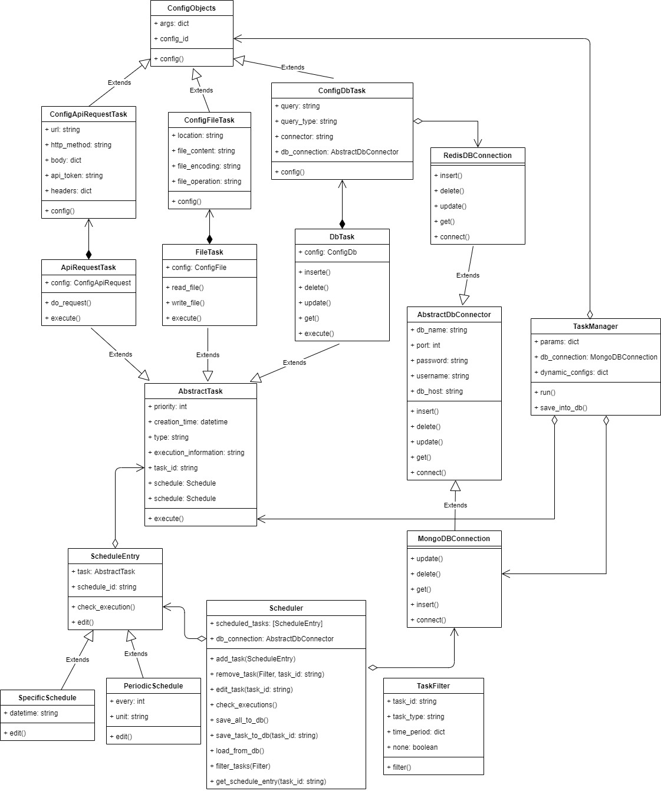

# Task scheduler AT

## Install

```bash
# create virtualenv
virtualenv --python=python3

# activate the virtualenv
. venv/bin/activate

# install requirements
pip install -r requirements.txt
pip install -r requirements.dev.txt
```
### Steps

 - First: execute the ```task_scheduler\endpoints\config_init.py``` script
 - Second: execute ```task_scheduler\endpoints\endpoint.py``` script 
 - Third: You can use POSTMAN to interact with the endpoint -> ```http://localhost:5000/api/v1/run```

### Request POST example

```
{
"type_task": "File",
"configuration_id": "608b089952edc4196103c32c"
}
```

## Class diagram
## Update

[XML](docs/task-manager.xml)



